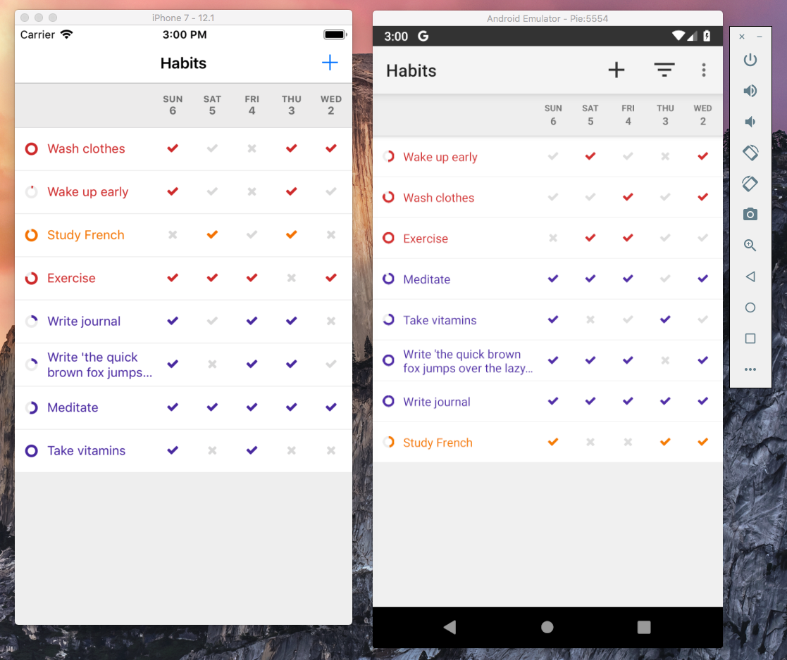

# Loop Habit Tracker

Loop is a mobile app that helps you create and maintain good habits. While the original app was developed exclusively for Android, this branch contains a work-in-progress proof-of-concept multi-platform version of the app, which targets Android and iOS.  **The software in this branch is still in pre-alpha stage. Expect bugs, incomplete features and poor performance.** Suggestions and pull requests are very welcome.

  

### 1. Required Tools and Libraries

Currently, the project can only be built on macOS. The following tools and libraries need to be installed separately, before attempting to build the application. The versions below have been tested and are know to work. Newer versions may produce errors.

* XCode 10.1
* Android Studio 3.3
* node 10.15.0 (`brew install node`)
* Android Platform Tools 28.0.1 (`brew cask install android-platform-tools`)

### 2. Build Instructions

The application is composed by four different modules: (1) the **core** module, written in Kotlin/Native, which contains all the shared business logic; (2) the **react-native** module, written in JavaScript, which contains all the front-end code; (3) the **android** module, written in Kotlin, which contains just enough code to allow the two previous modules to run on Android; and (4) the **ios** module, written in Swift, which allows the first two modules to run on iOS.

### 2.1. Building the **core** module

In the terminal, navigate to the `core/` folder and run `./gradlew build`. No further steps are needed. The Kotlin/Native compiler will be automatically downloaded and installed, if necessary.

The main outputs during this phase are `core/build/libs/core-jvm.jar`, a pure-java library used by Android, and `core/build/bin/iOS/main/debug/framework/core.framework`, a framework used by iOS.

**Note:** By default, we build an x64 framework, which only runs in the simulator. To produce an arm64 framework instead, which can be installed on a real iPhone, see instruction in the file `core/build.gradle`.

### 2.2. Installing `react-native`

In the terminal, navigate to the `react-native/` folder and run `npm install`. This will download and install not only all JavaScript dependencies, but also some libraries used by the **android** and **ios** modules. Therefore it's very important to execute this step before the two steps below.

### 2.3. Building the iOS application

Open the file `ios/uhabits.xcodeproj` in Xcode, select your desired device and click the play button on the top left corner of the screen. After a long compilation, the simulator should start. A terminal window, running React Native, should also be automatically started.

### 2.4. Building the Android application

1. Before you start, make sure that React Native is running. This can be done by navigating to the `react-native` folder and running `npm start`. Alternatively, you can also simply run the iOS app from Xcode, since this also automatically starts React Native.
1. Open Android Studio, click `Import Project (Gradle, Eclipse ADT, etc)`, select the folder `android` and click open.
2. After Android Studio finishes syncing the project, click the menu `Run / 'Run android'`. If an error appears saying the the project failed to sync properly, click the menu `File / Sync Project with Gradle Files` and try again. If you do not have any emulators configured, you will need to create one at this time. Any device and system image should work.
3. After the application starts, if a red error screen appears, this indicates that the app is not able to connect to our React Native daemon. In the terminal, run `adb reverse tcp:8081 tcp:8081`. Then, in the emulator window, press `Command+M`. Click `Settings / Debug server host & port for device`. Enter `127.0.0.1:8081`, click OK, then restart the application.
